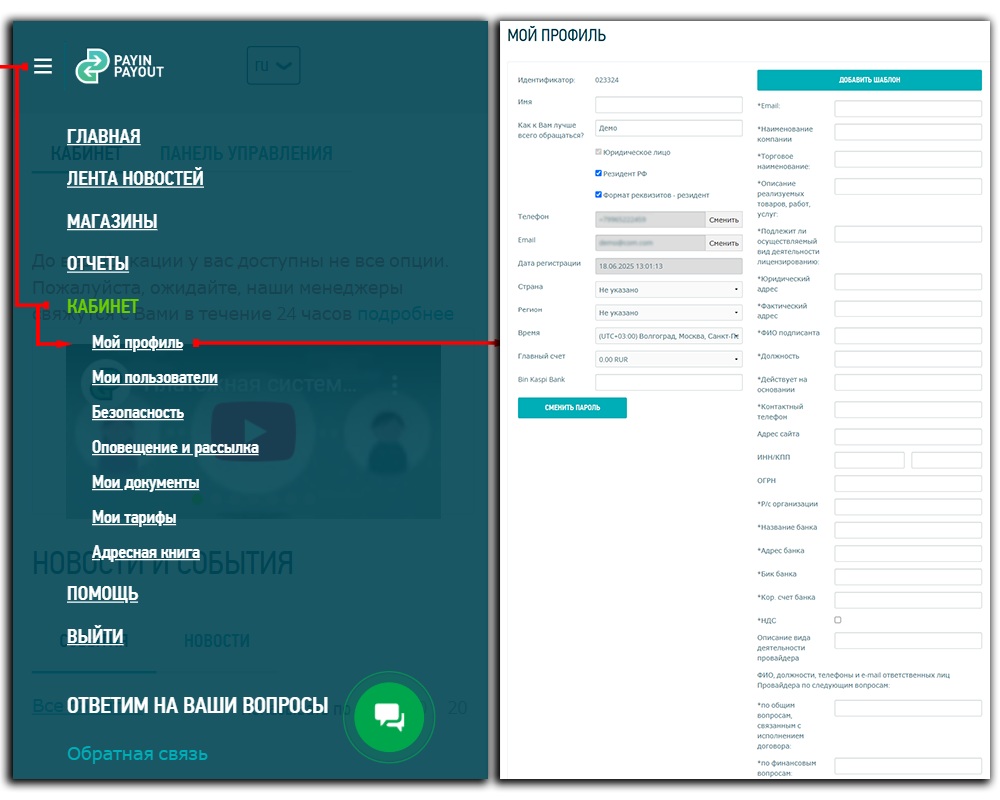
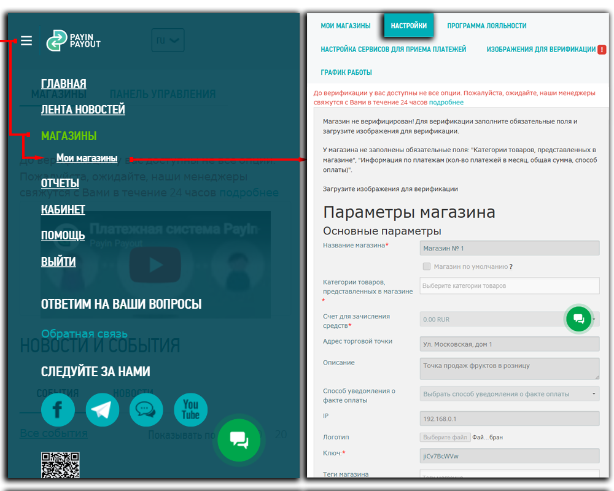
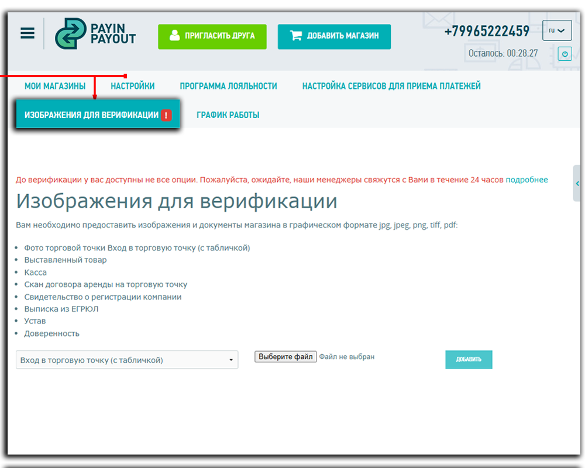

# Пошаговая инструкция по созданию и настройке магазина в системе Payin-Payout

Перед тем как приступить к работе, нужно пройти регистрацию в системе "Payin-Payout", указать свои данные в профиле и открыть магазин в соответствующих разделах. 

 Рассмотрим детально:

<table>
  <tr>
    <td>
В левом верхнем углу сайта откройте меню, выберите раздел «КАБИНЕТ» и перейдите в 
      <a href="https://lk.payin-payout.net/app/#/cabinet/profile" title="«Мой профиль»">«Мой профиль»</a>.
 
      Заполните все поля, помеченные звёздочкой (*), и нажмите «Сохранить»</td>
    <td></td>
  </tr>
  <tr>
    <td>
Затем перейдите в раздел «МАГАЗИНЫ» и выбираем  
        <a href="https://lk.payin-payout.net/app/#/shops/index" title="«Мои магазины»">«Мои магазины»</a>.
        На открывшейся странице нажмите на "+ Создать новый магазин". 
      

      

        В открывшемся окне придумайте название для нового магазина, выберите тип магазина и нажмите 
        на кнопку "Создать магазин". Далее откроется страница «НАСТРОЙКИ» с настройками магазина, 
        где необходимо дозаполнить поля, помеченные звёздочкой (*) и сохранить изменения.
      

      <blockquote>
        Обратите внимание на настройку «Способ уведомления о факте оплаты». 
        В этом поле вы можете выбрать метод получения callback-уведомлений от нашего сервера.
      </blockquote></td>
    <td></td>
  </tr>
    <tr>
    <td>Завершив с настройку магазина, перейдите на страницу «ИЗОБРАЖЕНИЕ ДЛЯ ВЕРИФИКАЦИИ» и загрузите требуемые документы.</td>
    <td></td>
    </tr>
</table>

По завершению всех настроек сообщите об этом менеджеру для осуществления верификации магазина.