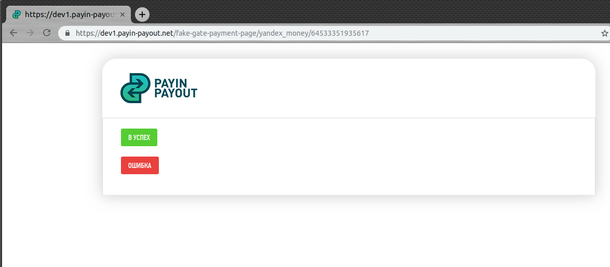

# Тестирование интеграции

В рамках тестирования подключения к системе Payin-Payout возможно протестировать свою интеграцию
с помощью тестового стенда расположенного по адресу https://dev1.payin-payout.net/

С помощью этого стенда можно производить все те же самые действия что и в настоящей системе, за
исключением того что не происходит списание и зачисление реальных средств.

Возможно создавать счета на пополнение баланса и счета выставленные от магазина и оплачивать их.
Вместо реальной оплаты с указанием платёжных данных отображается страница которая позволят эмулировать
успешную и не успешную оплаты.

При нажатии кнопки "Успех" произойдёт зачисление средств на учётную запись, отправка колбеков в случае
если это был счёт выставленный от магазина, перенаправление на страницу success url.

При нажатии кнопки "Ошибка" произойдёт перенаправление на страницу fail url.

